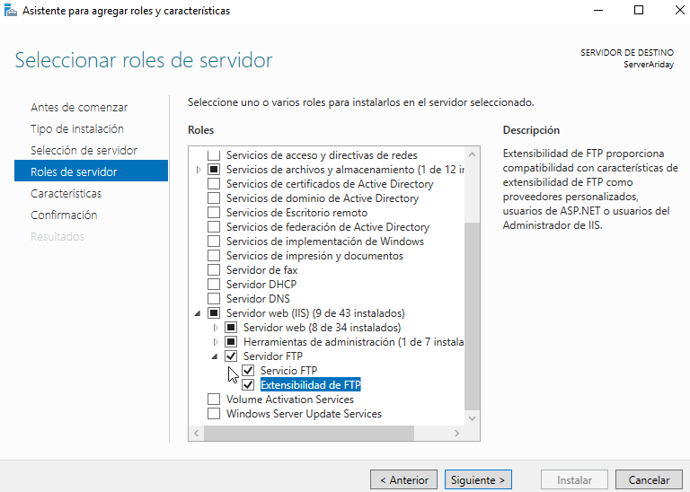
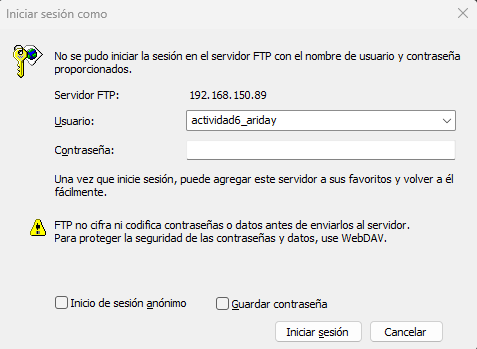
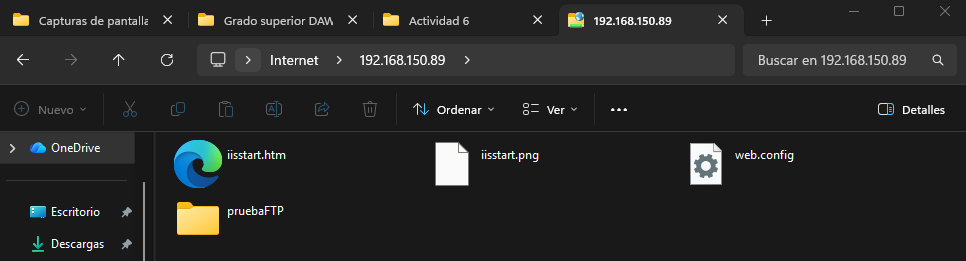
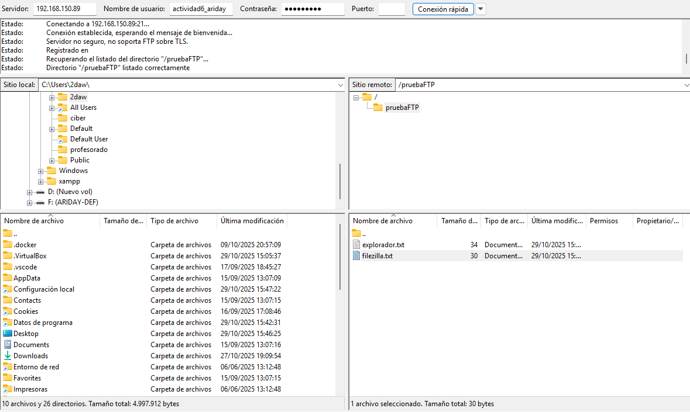

# 📁 Configuración de un Servidor FTP en Windows Server 2019

## 📌 Descripción del proyecto

Este proyecto consiste en la **instalación, configuración y comprobación de un servidor FTP y FTPS en Windows Server 2019**, utilizando el servicio **IIS (Internet Information Services)**.

El objetivo es aprender a:
- Instalar el rol de servidor FTP.
- Configurar un sitio FTP funcional.
- Crear y gestionar usuarios con permisos.
- Comprobar el acceso desde clientes FTP.
- Implementar **FTPS** para conexiones seguras mediante SSL.

Proyecto realizado como práctica educativa del ciclo **2º CFGS Desarrollo de Aplicaciones Web (DAW)**.

---

## 🛠️ Tecnologías utilizadas

- Windows Server 2019  
- IIS (Internet Information Services)  
- Servidor FTP / FTPS  
- Firewall de Windows Defender  
- Explorador de archivos de Windows  
- FileZilla Client  
- Certificados SSL  

---

## ⚙️ Instrucciones de instalación y ejecución

### 1️⃣ Instalación del servicio FTP

1. Administrar → Agregar roles y características  
2. Instalación basada en roles o características  
3. Seleccionar el servidor  
4. Marcar:
   - Servidor Web (IIS)
   - Servidor FTP
   - Extensibilidad de FTP
   - 
5. Instalar

---

### 2️⃣ Configuración del servidor FTP

1. Abrir Administrador de IIS  
2. Sitios → Agregar sitio FTP  
3. Indicar nombre y ruta del sitio  
4. Configurar IP y puerto  
5. Definir autenticación y permisos  

---

### 3️⃣ Creación de usuario FTP

1. Herramientas → Administración de equipos  
2. Usuarios y grupos locales → Usuarios  
3. Crear usuario con contraseña  
4. Asignar permisos de escritura a la carpeta FTP  

---

### 4️⃣ Configuración del Firewall

1. Firewall de Windows Defender → Configuración avanzada  
2. Crear regla de entrada por puerto  
3. Permitir conexión  
4. Aplicar a todos los perfiles  

Comprobación del puerto:
netstat - | find "<puerto>"

---

### 5️⃣ Comprobación del funcionamiento

**Explorador de Windows**
ftp://usuario@ip_servidor:puerto

**FileZilla**
- IP del servidor
- Usuario
- Contraseña
- Puerto

---

### 6️⃣ Configuración de FTPS

1. IIS → Sitio FTP → Configuración SSL de FTP  
2. Seleccionar certificado SSL  
3. Permitir conexiones SSL  
4. Añadir enlace FTP puerto 990  

---
